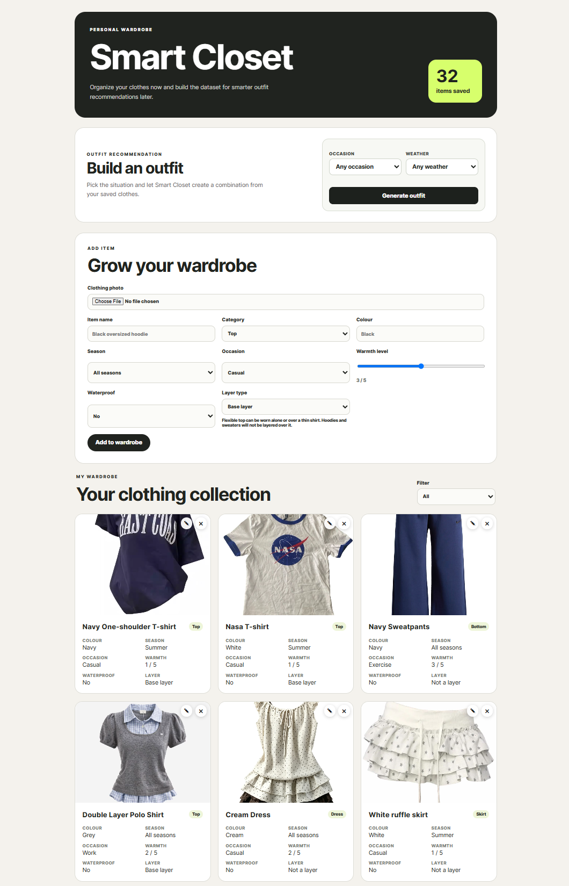

Smart Closet

An AI-powered wardrobe organizer and outfit recommendation application built with React, FastAPI, and CLIP.

Smart Closet lets users upload clothing photos, automatically fills garment details, stores a digital wardrobe, and generates outfit combinations based on occasion, weather, layering rules, and previous feedback.

## App Preview

## Features

Upload and organize clothing items with photos

AI-assisted clothing classification using CLIP

Automatic suggestions for:

Item name

Category

Colour

Season

Occasion

Warmth level

Waterproof level

Layer type

Edit and delete saved wardrobe items

Generate outfits using saved clothing

Filter recommendations by occasion and weather

Layer-aware outfit generation

Colour and style compatibility scoring

Like or dislike recommendations to influence future rankings

Local CSV-based storage for wardrobe and feedback data

Responsive React interface

How the AI is used

Smart Closet uses the openai/clip-vit-base-patch32 model as a zero-shot image classifier.

When a user uploads a clothing image, the backend compares the image against a set of garment, colour, and style labels. The highest-ranked predictions are used to pre-fill the item form. Users can review and correct the suggestions before saving them.

The outfit recommendation system then scores possible combinations using:

Occasion compatibility

Weather and warmth requirements

Colour compatibility

Layering rules

Style compatibility

User likes and dislikes

Recent recommendation history

The current recommendation engine combines machine-learning predictions with rule-based ranking.

Technology stack

Frontend

React

Vite

JavaScript

CSS

Backend

Python

FastAPI

Pandas

Hugging Face Transformers

PyTorch

Pillow

Machine learning

OpenAI CLIP ViT-B/32

Zero-shot image classification

Project structure

smart-closet/
├── backend/
│   ├── app/
│   │   └── main.py
│   ├── ml_classifier.py
│   ├── evaluate_classifier.py
│   ├── test_classifier.py
│   └── requirements.txt
├── frontend/
│   ├── src/
│   │   ├── App.jsx
│   │   ├── main.jsx
│   │   └── styles.css
│   ├── package.json
│   └── vite.config.js
├── docs/
│   └── smart-closet-preview.png
├── .gitignore
└── README.md

Wardrobe data, feedback CSV files, uploaded clothing photos, virtual environments, build output, and backup files are excluded from Git.

Run locally

Prerequisites

Install:

Python 3.10 or newer

Node.js and npm

Git

1. Clone the repository

git clone https://github.com/amieweima/smart-closet.git
cd smart-closet

2. Set up the backend

On Windows PowerShell:

python -m venv .venv
Set-ExecutionPolicy -Scope Process -ExecutionPolicy RemoteSigned
.\.venv\Scripts\Activate.ps1
pip install -r backend\requirements.txt
python -m uvicorn backend.app.main:app --reload

The backend will run at:

http://127.0.0.1:8000

The CLIP model is downloaded the first time classification is used, so the first prediction may take longer.

3. Set up the frontend

Open another terminal:

cd frontend
npm install
npm run dev

Open the URL shown by Vite, usually:

http://localhost:5173

Privacy

The repository does not include the developer's wardrobe database, uploaded clothing images, or feedback records.

Each local installation creates and stores its own data inside ignored backend folders.

Current limitations

The application currently runs locally and is not deployed.

Wardrobe and feedback data use local CSV storage rather than a production database.

Classification accuracy depends on image quality and available labels.

Outfit recommendations are limited to the clothing saved by the user.

The first ML inference may be slow while the model loads.

Shoes and accessories are stored but are not yet fully integrated into outfit generation.

Future improvements

Add shoes and accessories to outfit recommendations

Use image embeddings from fashion reference datasets

Replace CSV storage with a relational database

Add user accounts and cloud image storage

Add real-time weather integration

Deploy the frontend and backend

Improve recommendation learning from user feedback

Add automated tests and continuous integration

Author

Created by Seohyun Woo.